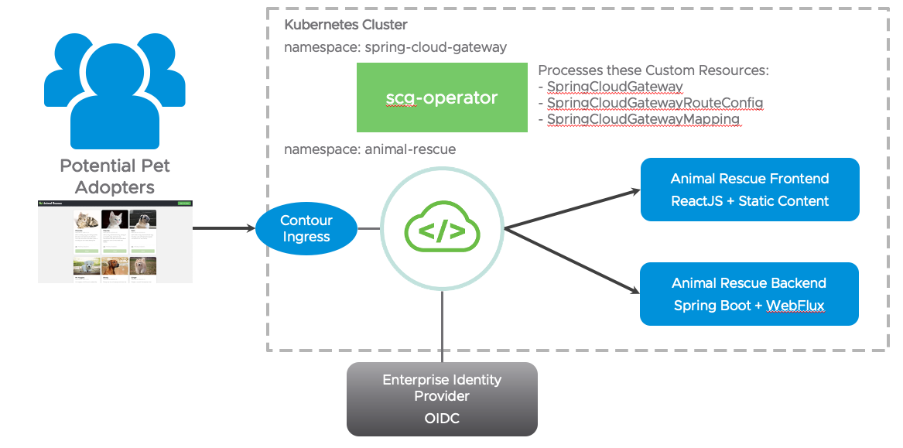
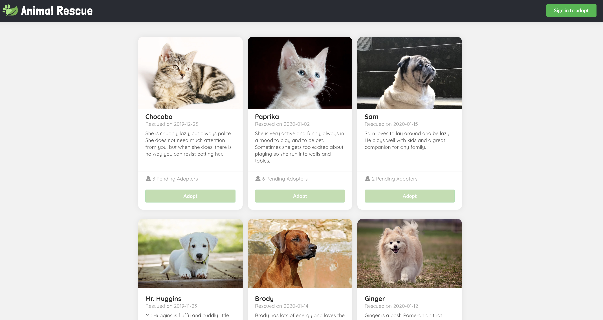
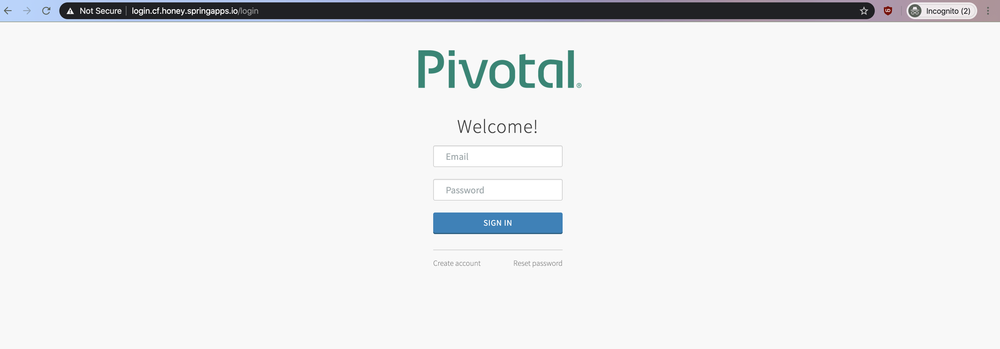
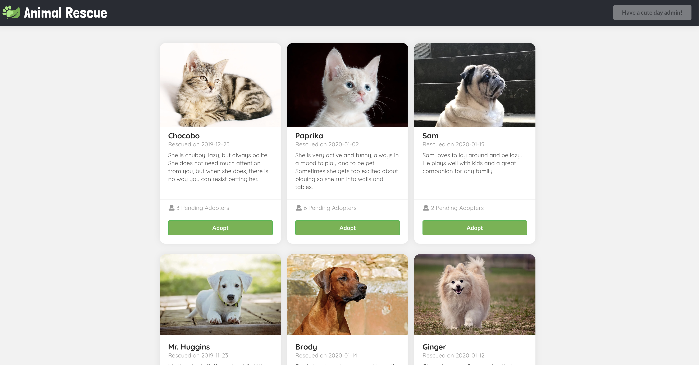
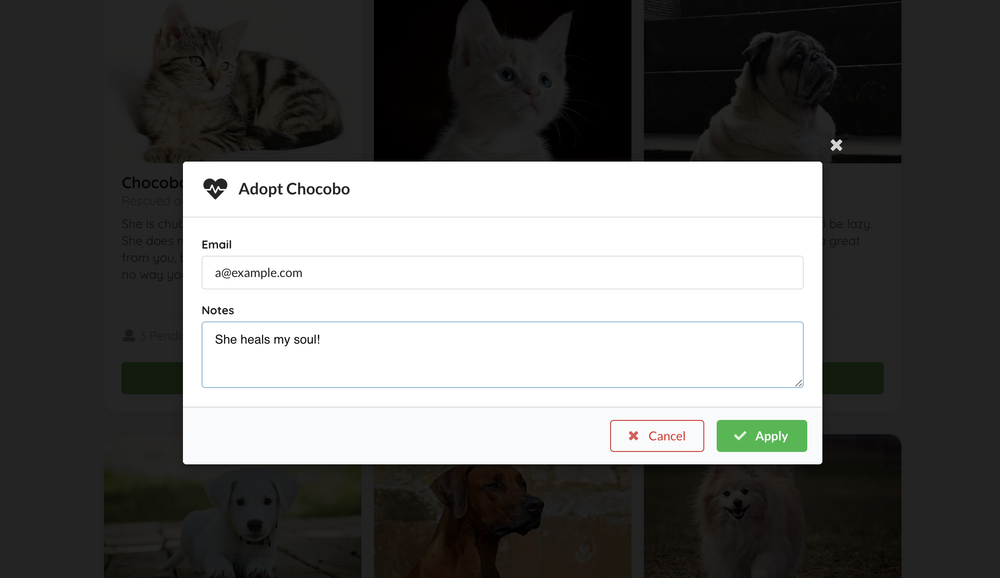
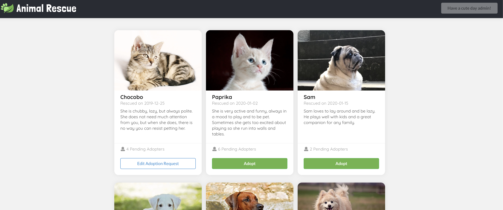
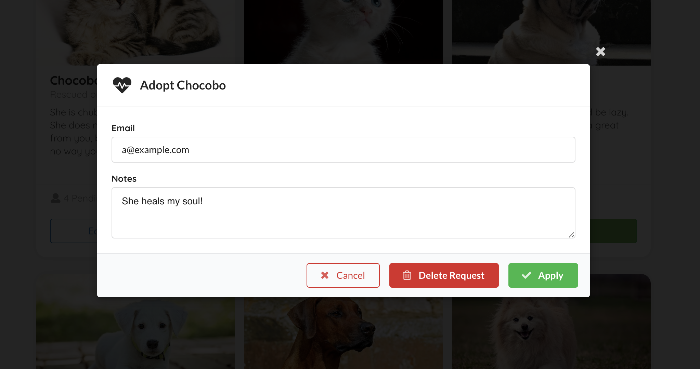

# Animal Rescue


Sample app for VMware's Spring Cloud Gateway commercial products. Features we demonstrate with this sample app:

- Routing traffic to configured internal routes with container-to-container network
- Gateway routes configured through service bindings
- Simplified route configuration
- SSO login and token relay on behalf of the routed services
- Required scopes on routes (tag: `require-sso-scopes`)
- Circuit breaker filter
- OpenAPI route conversion
- OpenAPI auto generation



## Table of Contents

* [Deploy to Kubernetes](#deploy-to-kubernetes)
* [Deploy to Tanzu Application Service](#deploy-to-tanzu-application-service)
* [Special frontend config related to gateway](#special-frontend-config-related-to-gateway)
* [Gateway and Animal Rescue application features](#gateway-and-animal-rescue-application-features)
* [OpenAPI Generation and Route Conversion](#openapi-generation-and-route-conversion-features)
* [Development](#development)

## Deploy to Kubernetes

The Kubernetes deployment requires you to install [kustomize](https://kustomize.io/). You will also need to install [Spring Cloud Gateway for Kubernetes](https://network.pivotal.io/products/spring-cloud-gateway-for-kubernetes) successfully onto your target Kubernetes cluster.

### Configure Single Sign-On (SSO)

For information configuring Okta as the SSO provider, see [go here](https://docs.vmware.com/en/VMware-Spring-Cloud-Gateway-for-Kubernetes/2.0/scg-k8s/GUID-guides-sso-okta-tutorial.html).

For Animal Rescue sample Single Sign-On (SSO) to work, you will need to create two text files that will be used to create Kubernetes secrets:

* ./backend/secrets/sso-credentials.txt
* ./gateway/sso-secret-for-gateway/secrets/test-sso-credentials.txt

Before you start, and for validation, please locate the JWKS endpoint info from your SSO identity provider. The endpoint typically exists at:

```
https://YOUR_DOMAIN/.well-known/openid-configuration
```

For example, when using Okta the configured Issuer URI and JWKS URI can be retrieved at:

```
https://<issuer-uri>/.well-known/openid-configuration

$ curl https://dev-1234567.okta.com/oauth2/abcd12345/.well-known/openid-configuration

{
  "issuer": "https://dev-1234567.okta.com/oauth2/abcd12345",
...
  "jwk-set-uri": "https://dev-1234567.okta.com/oauth2/abcd12345/v1/keys",
....

# Please note that the format used by Okta is jwk-set-uri="<issuer-uri>/v1/keys"
```

The contents of the `./backend/secrets/sso-credentials.txt` file for example would be the following:

```
jwk-set-uri=https://dev-1234567.okta.com/oauth2/abcd12345/v1/keys
```

The contents of the `./gateway/sso-secret-for-gateway/secrets/test-sso-credentials.txt` file includes the following values from your OpenID Connect (OIDC) compliant SSO identity provider:

```
scope=openid,profile,email
client-id={your_client_id}
client-secret={your_client_secret}
issuer-uri={your_issuer_uri}
```

### Configure Ingress

The K8s deploy leverages an Ingress object to easily expose your application outside of the cluster.
Before starting, confirm that you have an ingress controller installed into your cluster.
[Contour](https://projectcontour.io/) is a good choice if you don't already have a favorite.

Next, edit `gateway/gateway-demo.yaml` to set the domain to your domain.
If you don't have a domain that you can use, leveraging [`nip.io`](https://nip.io/) is a good choice.

  **Important**
  Once you have your domain, remember to configure it as an accepted `redirect_uri` in your SSO provider. Otherwise, application login will fail.


### Deploy with Kustomize (recommended)

Assuming you are authenticated onto target Kubernetes cluster, you can run the following command from top-level directory in the repository:

```bash
kustomize build . | kubectl apply -f -
```

This will create a namespace named `animal-rescue`, create a new gateway instance named `gateway-demo` in that namespace, deploy the frontend and backend Animal Rescue applications and finally apply the application specific API route configurations to `gateway-demo`.

### Deploy with Kubectl

If you don't want to use `kustomize`, you can apply each yaml file in the [`kustomization.yaml`](kustomization.yaml) file manually into the `animal-rescue` namespace (or any namespace you prefer) as well as create the `sso-credentials` secret from `backend/secrets/sso-credentials.txt` and `animal-rescue-sso` secret from `gateway/sso-secret-for-gateway/secrets/test-sso-credentials.txt`.

Make sure to create the SSO credentials secret in the SCG installation namespace (`spring-cloud-gateway` by default).

The gateway instance created, named `gateway-demo`, doesn't have any API routes defined initially. Once the API route definitions defined in a `SpringCloudGatewayRouteConfig` objects are mapped to `gateway-demo` using the `SpringCloudGatewayMapping` objects, you will see the routes added to the gateway.

### Accessing Animal Rescue Site

After deploying Animal Rescue, there will be an Ingress created.
You can then access Animal Rescue at the URL set by the Ingress created
in `gateway/gateway-demo.yaml`.
For example, `http://animal-rescue.my.domain.io/rescue`.

## Deploy to Tanzu Application Service

Run the following scripts to set up everything:
```bash
./scripts/cf_deploy init    # installs dependencies and builds the deployment artifact
./scripts/cf_deploy deploy  # handles everything you need to deploy the frontend, backend, and gateway. This script can be executed repeatedly to deploy new changes.
```
Then visit the frontend url `https://gateway-demo.${appsDomain}/rescue` to view the sample app.

Once you have enough fun with the sample app, run the following script to clean up the environment:
```bash
./scripts/cf_deploy destroy # tears down everything
```

Some other commands that might be helpful:
```bash
./scripts/cf_deploy push                     # builds and pushes frontend and backend
./scripts/cf_deploy dynamic_route_config_update  # update bound apps' configuration with calling the update endpoint on the backing app. You will need to be a space developer to do so.
./scripts/cf_deploy rebind                   # unbinds and rebinds frontend and backend
./scripts/cf_deploy upgrade                  # upgrade the gateway instance
```

All the gateway configuration can be found and updated here:

- Gateway service instance configuration file used on create/update: `./api-gateway-config.json`
- Frontend routes configuration used on binding used on bind: `./frontend/api-route-config.json`
- Backend routes configuration used on binding used on bind:`./backend/api-route-config.json`

## Special frontend config related to gateway

The frontend application is implemented in ReactJS, and is pushed with static buildpack. Because of it's static nature, we had to do the following:

1. `homepage` in `package.json` is set to `/rescue`, which is the path we set for the frontend application in gateway config (`frontend/api-route-config.json`). This is to make sure all related assets is requested under `/rescue` path as well.
1. `Sign in to adopt` button is linked to `/rescue/login`, which is a path that is `sso-enabled` in gateway config (`frontend/api-route-config.json`). This is necessary for frontend apps bound to a sub path on gateway because the Oauth2 login flow redirects users to the original requested location or back to `/` if no saved request exists. This setting is not necessary if the frontend app is bound to path `/`.
1. `REACT_APP_BACKEND_BASE_URI` is set to `/backend` in build script, which is the path we set for the backend application in gateway config (`backend/api-route-config.json`). This is to make sure all our backend API calls are appended with the `backend` path.

## Gateway and Animal Rescue application features

Visit `https://gateway-demo.${appsDomain}/rescue`, you should see cute animal bios with the `Adopt` buttons disabled. All the information are fetched from a public `GET` backend endpoint `/animals`.


Click the `Sign in to adopt` button in the top right corner, you should be redirected to the SSO login page if you haven't already logged in to SSO.


Once you logged in, you should see a greeting message regarding the username you log in with in the top right corner, and the `Adopt` buttons should be enabled.


Click on the `Adopt` button, input your contact email and application notes in the model, then click `Apply`, a `POST` request should be sent to a `sso-enabled` backend endpoint `/animals/{id}/adoption-requests`, with the adopter set to your username we parsed from your token.


Then the model should close, and you should see the `Adopt` button you clicked just now has turned into `Edit Adoption Request`. This is matched by your SSO log in username.


Click on the `Edit Adoption Request` again, you can view, edit (`PUT`), and delete (`DELETE`) the existing request.


    **Note**
    Documentation may get out of date. Please refer to the [e2e test](./e2e/cypress/integration/) and the test output video for the most accurate user flow description.

To see circuit breaker filter in action, stop `animal-rescue-frontend` application and refresh page. You should see a response from `https://example.org` web-site, this is configured in `api-route-config.json` file in `/fallback` route.

## OpenAPI Generation and Route conversion features

### Route Conversion
The Spring Cloud Gateway Operator offers an OpenAPI Route Conversion Service that can be used to automate the creation of a `SpringCloudGatewayRouteConfig` based off an OpenAPI document (v2 or v3),
The full details of this service can be [found here](https://docs.vmware.com/en/VMware-Spring-Cloud-Gateway-for-Kubernetes/2.1/scg-k8s/GUID-guides-openapi-route-conversion.html), but you fill find an example
below of how it was used in animal rescue.

The animal rescue backend exposes an OpenAPI v3 document at `/api-docs`, which is auto generated using the [springdoc](https://springdoc.org/) library.

The `SpringCloudGatewayRouteConfig` for the animal rescue backend, which can be found in `/backend/k8s/animal-rescue-backend-route-config.json`
was generated using the OpenAPI Route Conversion Service by pointing it to that OpenAPI document.

The full command that was used to generate it can be found below.

**Note:** In the example the Spring Cloud Gateway Operator pod has been port forwarded to port 5566. 

```commandline
curl --request POST 'http://localhost:5566/api/convert/openapi' \
--header 'Content-Type: application/json' \
--data-raw '{
    "service": {
        "namespace": "animal-rescue",
        "name": "animal-rescue-backend",
        "ssoEnabled": true,
        "filters": ["RateLimit=10,2s"]
    },
    "openapi": {
        "location": "/api-docs"
    },
    "routes": [
        {
          "predicates": ["Method=GET","Path=/animals"],
          "filters": [],
          "ssoEnabled": false
        },
        {
           "predicates": ["Method=GET,PUT,POST,DELETE","Path=/**"],
            "filters": [],
            "tokenRelay": true
        },
        {
            "predicates": ["Method=GET,PUT,PATCH,POST,DELETE","Path=/actuator/**"],
             "filters": [],
             "ssoEnabled": false
        }
    ]
}' | sed 's/Path=/Path=\/api/g' \
   | sed 's/"animal-rescue-backend"/"animal-rescue-backend-route-config"/' 
```

The full details of how the service works can be [found here](https://docs.vmware.com/en/VMware-Spring-Cloud-Gateway-for-Kubernetes/2.1/scg-k8s/GUID-guides-openapi-route-conversion.html), but below you will
find a brief summary of what the above command does.

- Specifies the namespace/name of the service that fronts the animal rescue backend provide the path to the OpenAPI document.
- Specifies some filters at the service level that should be applied to all routes
- Specifies some exceptions to the service level filters at the individual route level
  - i.e we turn off SSO for the endpoint that gets all animals as well as the actuator endpoints
- We use sed to append the path '/api' to all the paths since that is how we want to expose the urls to the outside world.
  - Note that by default the operator will add a `StripPrefix=1` to every route which is why we don't explicitly have to add that filter here
- We use sed to change the default name for the generated `SpringCloudGatewayRouteConfig`. By default, it will give it the name of the service, but for consistency
  with the other examples in this project we append "-route-config" to the name. 


### OpenAPI Generation
Spring Cloud Gateway for Kubernetes also offers a service to generate OpenAPI v3-compliant documentation for the gateways that it manages. 
When combined with the Route Conversion Service mentioned above this can be a powerful way to expose the details of your APIs their consumers.

By default, the service will return an array of all the OpenAPI documents of the gateways it manages. There are options, however, to restrict the documents that are retrieved. 
The full details of this feature can be [found here](https://docs.vmware.com/en/VMware-Spring-Cloud-Gateway-for-Kubernetes/2.1/scg-k8s/GUID-guides-openapi-generation.html), 
but below you find some details on how it can be used with animal rescue.

One option is to limit the results to a single OpenAPI document for a specific gateway. You can do this by using the **namespace** and **name** of that gateway as part of the path. 
For example, if you are port forwarding the `scg-openapi-service` to port 5566 you could get the OpenAPI document specific to the `gateway-demo`
with the following curl call:

```commandline
curl http://localhost:5566/openapi/animal-rescue/gateway-demo
```

One thing you might notice with the call above is that the returned OpenAPI document only has routes for to the animal rescue backend, even though the `gateway-demo` also has `SpringCloudGatewayRouteDefinition` for the front end.
(`frontend/k8s/animal-rescue-frontend-route-config.yaml`). The reason for this is that the OpenAPI Generation provides the ability to control which of your routes will show up in the generated document. In the case of 
the animal rescue, the OpenAPI generation is turned off for everything in the route config by setting `spec.openapi.generation.enabled=false` (see example below). You also have the ability to control it
at the route level with `spec.routes.openapi.generation.enabled`. The full details can be [found here](https://docs.vmware.com/en/VMware-Spring-Cloud-Gateway-for-Kubernetes/2.1/scg-k8s/GUID-guides-openapi-generation.html)
routes 

```commandline
spec:
  service:
    name: animal-rescue-frontend
    ssoEnabled: false
  openapi:
    generation:
      enabled: false
```

## Development

### Run locally

Use the following commands to manage the local lifecycle of animal-rescue:

```bash
./scripts/local.sh start         # start auth server, frontend app, and backend app
./scripts/local.sh start --quiet # start everything without launching the app in browser, and redirects all output to `./scripts/out/`
./scripts/local.sh stop          # stop auth server, frontend app, and backend app. You would only need to do this if you start the app in quiet mode.
```

### Local security configuration

Backend uses Form login for local development with two test accounts - `alice / test` and `bob / test`.
Note that in a real deployment with Gateway, OAuth2 login will be managed by the gateway itself, and your app should use `TokenRelay` filter to receive OpenID ID Token in `Authorization` header. See `CloudFoundrySecurityConfiguration` class for an example of Spring Security 5 configuration to handle token relay correctly.

> It is also possible to use OAuth2 login flow for the app. This requires running an authorization server locally. See `local-oauth2-flow` for an example of using Cloud Foundry User Account and Authentication (UAA) running in a Docker container locally.

### Tests

Execute the following script to run all tests:

```bash
./scripts/local.sh init          # install dependencies for the frontend folder and the e2e folder
./scripts/local.sh ci            # run backend tests and e2e tests
./scripts/local.sh backend       # run backend test only
./scripts/local.sh e2e --quiet   # run e2e test only without interactive mode
```

You can find an e2e test output video showing the whole journey in `./e2e/cypress/videos/` after the test run. If you would like to launch the test in an actual browser and run e2e test interactively, you may run the following commands:

```bash
./scripts/local.sh start
./scripts/local.sh e2e
```

More detail about the e2e testing framework can be found at [cypress api doc](https://docs.cypress.io/api/api/table-of-contents.html)

### CI

#### GitHub Actions

GitHub Actions run all checks for the `main` branch and all PR requests. All workflow configuration can be found in `.github/workflows`.

#### Concourse

If you'd like to get the most updated sample app deployed in a real TAS environment, you can set up a concourse pipeline to do so:

```bash
fly -t ${yourConcourseTeamName} set-pipeline -p sample-app-to-demo-environment -c concourse/pipeline.yml -l config.yml
```

You will need to update the Slack notification settings and add the following environment variables to your concourse credentials manager. Here are the variables we set in our concourse credhub:

```
- name: /concourse/main/sample-app-to-demo-environment/CF_API_HOST
- name: /concourse/main/sample-app-to-demo-environment/CF_USERNAME
- name: /concourse/main/sample-app-to-demo-environment/CF_PASSWORD
- name: /concourse/main/sample-app-to-demo-environment/SKIP_SSL_VALIDATION
- name: /concourse/main/sample-app-to-demo-environment/CF_ORG
- name: /concourse/main/sample-app-to-demo-environment/CF_SPACE
```

## Check out our tags

Tags that looks like `SCG-VT-v${VERSION}+` indicates that this commit and the commits after are compatible with the specified `VERSION` of the `SCG-VT` tile.

The other tags demonstrate different configuration with `SCG-VT`, have fun exploring what's possible!
