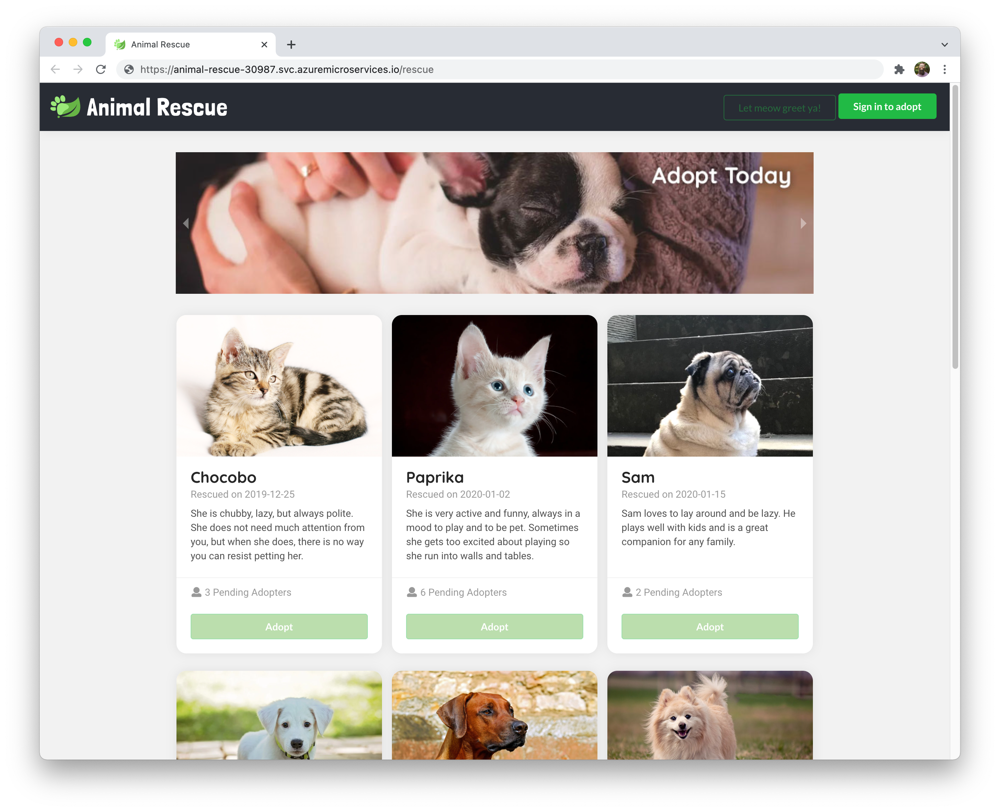
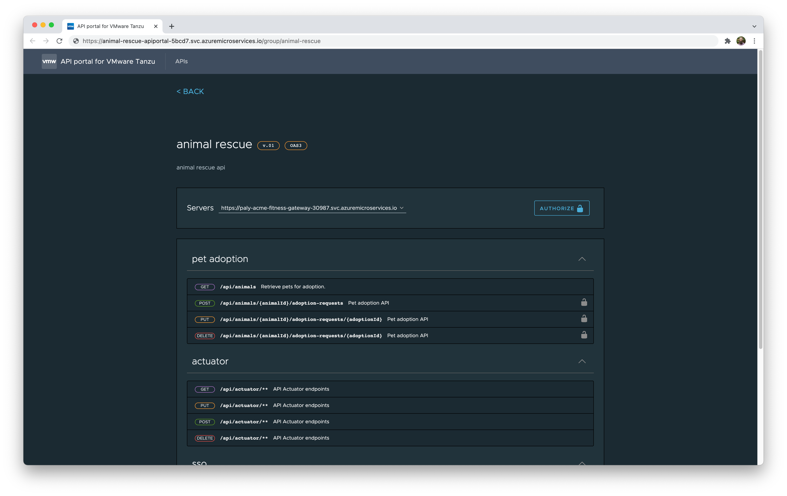

# Deploy Spring Boot apps using Azure Spring Cloud and Spring Cloud Gateway

Azure Spring Cloud enables you to easily run a Spring Boot applications on Azure.

This quickstart shows you how to deploy an existing Java Spring Cloud application to Azure. When
you're finished, you can continue to manage the application via the Azure CLI or switch to using the
Azure Portal.

* [Deploy Spring Boots using Azure Spring Cloud and Spring Cloud Gateway](#deploy-spring-boot-apps-using-azure-spring-cloud-and-spring-cloud-gateway)
  * [What will you experience](#what-will-you-experience)
  * [What you will need](#what-you-will-need)
  * [Install the Azure CLI extension](#install-the-azure-cli-extension)
  * [Clone the repo](#clone-the-repo)
  * [Unit 1 - Deploy and Build Applications](#unit-1---deploy-and-build-applications)
  * [Unit 2 - Configure Single Sign On](#unit-2---configure-single-sign-on)
  * [Unit 3 - Connect to Azure Database for MySQL](#unit-3---connect-to-azure-database-for-mysql)
  * [Unit 4 - Manage Application secrets using Azure KeyVault](#unit-4---manage-application-secrets-using-azure-keyvault)

## What will you experience
You will:
- Provision an Azure Spring Cloud service instance.
- Configure Application Configuration Service repositories
- Deploy Spring Boot applications to Azure and build using Tanzu Build Service
- Configure routing to the applications using Spring Cloud Gateway
- Open the application
- Explore the application API with Api Portal
- Configure Single Sign On (SSO) for the application
- Bind Applications to Azure Database for MySQL
- Manage application secrets using Azure KeyVault

## What you will need

In order to deploy a Java app to cloud, you need
an Azure subscription. If you do not already have an Azure
subscription, you can activate your
[MSDN subscriber benefits](https://azure.microsoft.com/pricing/member-offers/msdn-benefits-details/)
or sign up for a
[free Azure account]((https://azure.microsoft.com/free/)).

In addition, you will need the following:

| [Azure CLI version 2.17.1 or higher](https://docs.microsoft.com/cli/azure/install-azure-cli?view=azure-cli-latest)
| [Git](https://git-scm.com/)
| [`jq` utility](https://stedolan.github.io/jq/download/)
|

Note -  The [`jq` utility](https://stedolan.github.io/jq/download/). On Windows, download [this Windows port of JQ](https://github.com/stedolan/jq/releases) and add the following to the `~/.bashrc` file:
```shell
alias jq=<JQ Download location>/jq-win64.exe
```

Note - The Bash shell. While Azure CLI should behave identically on all environments, shell
semantics vary. Therefore, only bash can be used with the commands in this repo.
To complete these repo steps on Windows, use Git Bash that accompanies the Windows distribution of
Git. Use only Git Bash to complete this training on Windows. Do not use WSL.


### OR Use Azure Cloud Shell

Or, you can use the Azure Cloud Shell. Azure hosts Azure Cloud Shell, an interactive shell
environment that you can use through your browser. You can use the Bash with Cloud Shell
to work with Azure services. You can use the Cloud Shell pre-installed commands to run the
code in this README without having to install anything on your local environment. To start Azure
Cloud Shell: go to [https://shell.azure.com](https://shell.azure.com), or select the
Launch Cloud Shell button to open Cloud Shell in your browser.

To run the code in this article in Azure Cloud Shell:

1. Start Cloud Shell.

2. Select the Copy button on a code block to copy the code.

3. Paste the code into the Cloud Shell session by selecting Ctrl+Shift+V on Windows and Linux or by selecting Cmd+Shift+V on macOS.

4. Select Enter to run the code.


## Install the Azure CLI extension

Install the Azure Spring Cloud extension for the Azure CLI using the following command

```shell
az extension add --name spring-cloud
```
Note - `spring-cloud` CLI extension `3.0.0` or later is a pre-requisite to enable the
latest Enterprise tier functionality to configure VMware Tanzu Components. Use the following 
command to remove previous versions and install the latest Enterprise tier extension:

```shell
az extension remove --name spring-cloud
az extension add --name spring-cloud
```

## Clone the repo

### Create a new folder and clone the sample app repository to your Azure Cloud account

```shell
mkdir source-code
cd source-code
git clone --branch Azure https://github.com/Azure-Samples/animal-rescue
cd animal-rescue
```

## Unit-1 - Deploy and build Applications

### Prepare your environment for deployments

Create a bash script with environment variables by making a copy of the supplied template:

```shell
cp ./scripts/setup-env-variables-azure-template.sh ./scripts/setup-env-variables-azure.sh
```

Open `./scripts/setup-env-variables-azure.sh` and enter the following information:

```shell
export SUBSCRIPTION=subscription-id                 # replace it with your subscription-id
export RESOURCE_GROUP=resource-group-name           # existing resource group or one that will be created in next steps
export SPRING_CLOUD_SERVICE=azure-spring-cloud-name # name of the service that will be created in the next steps
export LOG_ANALYTICS_WORKSPACE=log-analytics-name   # existing workspace or one that will be created in next steps
export REGION=region-name                           # choose a region with Enterprise tier support
```

Then, set the environment:
```shell
source ./scripts/setup-env-variables-azure.sh
```

### Login to Azure
Login to the Azure CLI and choose your active subscription. Be sure to choose the active subscription that is whitelisted for Azure Spring Cloud

```shell
az login
az account list -o table
az account set --subscription ${SUBSCRIPTION}
```

### Create Azure Spring Cloud service instance
Prepare a name for your Azure Spring Cloud service.  The name must be between 4 and 32 characters long and can contain only lowercase letters, numbers, and hyphens.  The first character of the service name must be a letter and the last character must be either a letter or a number.

Create a resource group to contain your Azure Spring Cloud service.

> Note: This step can be skipped if using an existing resource group

```shell
az group create --name ${RESOURCE_GROUP} \
    --location ${REGION}
```

Accept the legal terms and privacy statements for the Enterprise tier.

> Note: This step is necessary only if your subscription has never been used to create an Enterprise tier instance of Azure Spring Cloud.

```shell
az provider register --namespace Microsoft.SaaS
az term accept --publisher vmware-inc --product azure-spring-cloud-vmware-tanzu-2 --plan tanzu-asc-ent-mtr
```

Create an instance of Azure Spring Cloud Enterprise.

```shell
az spring-cloud create --name ${SPRING_CLOUD_SERVICE} \
    --resource-group ${RESOURCE_GROUP} \
    --location ${REGION} \
    --sku Enterprise \
    --enable-application-configuration-service \
    --enable-service-registry \
    --enable-gateway \
    --enable-api-portal
```

The service instance will take around 10-15 minutes to deploy.

Set your default resource group name and cluster name using the following commands:

```shell
az configure --defaults \
    group=${RESOURCE_GROUP} \
    location=${REGION} \
    spring-cloud=${SPRING_CLOUD_SERVICE}
```

> Note: wait for the instance of Azure Spring Cloud to be ready before continuing

### Configure Log Analytics for Azure Spring Cloud

Create a Log Analytics Workspace to be used for your Azure Spring Cloud service.

> Note: This step can be skipped if using an existing workspace

```shell
az monitor log-analytics workspace create \
  --workspace-name ${LOG_ANALYTICS_WORKSPACE} \
  --location ${REGION} \
  --resource-group ${RESOURCE_GROUP}   
```

Retrieve the resource ID for the recently create Azure Spring Cloud Service and Log Analytics Workspace:

```shell
export LOG_ANALYTICS_RESOURCE_ID=$(az monitor log-analytics workspace show \
    --resource-group ${RESOURCE_GROUP} \
    --workspace-name ${LOG_ANALYTICS_WORKSPACE} | jq -r '.id')

export SPRING_CLOUD_RESOURCE_ID=$(az spring-cloud show \
    --name ${SPRING_CLOUD_SERVICE} \
    --resource-group ${RESOURCE_GROUP} | jq -r '.id')
```

Configure diagnostic settings for the Azure Spring Cloud Service:

```shell
az monitor diagnostic-settings create --name "send-logs-and-metrics-to-log-analytics" \
    --resource ${SPRING_CLOUD_RESOURCE_ID} \
    --workspace ${LOG_ANALYTICS_RESOURCE_ID} \
    --logs '[
         {
           "category": "ApplicationConsole",
           "enabled": true,
           "retentionPolicy": {
             "enabled": false,
             "days": 0
           }
         },
         {
            "category": "SystemLogs",
            "enabled": true,
            "retentionPolicy": {
              "enabled": false,
              "days": 0
            }
          },
         {
            "category": "IngressLogs",
            "enabled": true,
            "retentionPolicy": {
              "enabled": false,
              "days": 0
             }
           }
       ]' \
       --metrics '[
         {
           "category": "AllMetrics",
           "enabled": true,
           "retentionPolicy": {
             "enabled": false,
             "days": 0
           }
         }
       ]'
```

### Configure Application Configuration Service

Create a configuration repository for Application Configuration Service using the Azure CLI:

```shell
az spring-cloud application-configuration-service git repo add --name animal-rescue-config \
    --label main \
    --patterns "backend/default,backend/mysql,backend/key-vault" \
    --uri "https://github.com/Azure-Samples/animal-rescue-config" 
```

### Configure Tanzu Build Service

Create a builder in Tanzu Build Service for the frontend application using the Azure CLI:

```shell
az spring-cloud build-service builder create -n nodejs-only \
    --builder-file frontend/asc/nodejs_builder.json \
    --no-wait
```

### Create applications in Azure Spring Cloud

Create an application for the frontend and another for the backend:

```shell
az spring-cloud app create --name $BACKEND_APP --instance-count 1 --memory 1Gi
az spring-cloud app create --name $FRONTEND_APP --instance-count 1 --memory 1Gi
```

### Bind to Application Configuration Service

Bind the backend application to Application Configuration Service:

```shell
az spring-cloud application-configuration-service bind --app $BACKEND_APP
```

### Configure Spring Cloud Gateway

Assign an endpoint and update the Spring Cloud Gateway configuration with API 
information:

```shell
az spring-cloud gateway update --assign-endpoint true
export GATEWAY_URL=$(az spring-cloud gateway show | jq -r '.properties.url')
    
az spring-cloud gateway update \
    --api-description "Animal Rescue API" \
    --api-title "Animal Rescue" \
    --api-version "v.01" \
    --server-url "https://$GATEWAY_URL" \
    --allowed-origins "*"
```

Create routing rules for the backend and frontend applications:

```shell
az spring-cloud gateway route-config create \
    --name $BACKEND_APP \
    --app-name $BACKEND_APP \
    --routes-file backend/asc/api-route-config-no-sso.json

az spring-cloud gateway route-config create \
    --name $FRONTEND_APP \
    --app-name $FRONTEND_APP \
    --routes-file frontend/asc/api-route-config-no-sso.json
```

### Build and Deploy Applications

Deploy and build the backend application, specifying its configuration file pattern for
Application Configuration Service:

```shell
az spring-cloud app deploy --name $BACKEND_APP \
    --config-file-patterns backend/default \
    --source-path backend \
    --env "SPRING_PROFILES_ACTIVE=azure"
```

Deploy and build the frontend application using the builder created earlier:

```shell
az spring-cloud app deploy --name $FRONTEND_APP \
    --builder nodejs-only \
    --source-path frontend/
```

### Access the Application through Spring Cloud Gateway

Retrieve the URL for Spring Cloud Gateway and open it in a browser:

```shell
open "https://$GATEWAY_URL"
```

You should see the Animal Rescue Application:



### Explore the API using API Portal

Assign an endpoint to API Portal and open it in a browser:

```shell
az spring-cloud api-portal update --assign-endpoint true
export PORTAL_URL=$(az spring-cloud api-portal show | jq -r '.properties.url')

open "https://$PORTAL_URL"
```



## Unit 2 - Configure Single Sign On

### Register Application with Azure AD

Create an Application registration with Azure AD and save the output.

```shell
az ad app create --display-name animal-rescue > ad.json
```

Retrieve the Application ID and collect the client secret:

```shell
export APPLICATION_ID=$(cat ad.json | jq -r '.appId')

az ad app credential reset --id $APPLICATION_ID --append > sso.json
```

Assign a Service Principal to the Application Registration

```shell
az ad sp create --id $APPLICATION_ID
```

More detailed instructions on Application Registrations can be found [here](https://docs.microsoft.com/en-us/azure/active-directory/develop/quickstart-register-app).

### Prepare your environment for deployments

Set the environment using the provided script and verify the environment variables are set:

```shell
source ./scripts/setup-sso-variables-azure-ad.sh

echo $CLIENT_ID
echo $CLIENT_SECRET
echo $TENANT_ID
echo $ISSUER_URI
echo $JWK_SET_URI
```

The `ISSUER_URI` shhould take the form `https://login.microsoftonline.com/$TENANT_ID/v2.0`
The `JWK_SET_URI` should take the form `https://login.microsoftonline.com/$TENANT_ID/discovery/v2.0/keys`

Add the necessary redirect URIs to the Azure AD Application Registration:

```shell
az ad app update --id $APPLICATION_ID \
    --reply-urls "https://$GATEWAY_URL/login/oauth2/code/sso" "https://$PORTAL_URL/oauth2-redirect.html" "https://$PORTAL_URL/login/oauth2/code/sso"
```

Detailed information about redirect URIs can be found [here](https://docs.microsoft.com/en-us/azure/active-directory/develop/quickstart-register-app#add-a-redirect-uri).


### Configure Spring Cloud Gateway

Configure Spring Cloud Gateway with SSO enabled:

```shell
export GATEWAY_URL=$(az spring-cloud gateway show | jq -r '.properties.url')

az spring-cloud gateway update \
    --api-description "Animal Rescue API" \
    --api-title "Animal Rescue" \
    --api-version "v.01" \
    --server-url "https://$GATEWAY_URL" \
    --allowed-origins "*" \
    --client-id $CLIENT_ID \
    --client-secret $CLIENT_SECRET \
    --scope $SCOPE \
    --issuer-uri $ISSUER_URI
```

Update routing rules for the backend and frontend applications:

```shell
az spring-cloud gateway route-config update \
    --name $BACKEND_APP \
    --app-name $BACKEND_APP \
    --routes-file backend/asc/api-route-config.json

az spring-cloud gateway route-config update \
    --name $FRONTEND_APP \
    --app-name $FRONTEND_APP \
    --routes-file frontend/asc/api-route-config.json
```

### Update Spring Boot app with SSO

Update the backend application to provide the necessary environment variable:

```shell
az spring-cloud app update \
    --name $BACKEND_APP \
    --config-file-patterns backend/default \
    --env "SPRING_SECURITY_OAUTH2_RESOURCESERVER_JWT_JWKSETURI=$JWK_SET_URI" "SPRING_PROFILES_ACTIVE=azure"
```

### Access the Application through Spring Cloud Gateway

Retrieve the URL for Spring Cloud Gateway and open it in a browser:

```shell
open "https://$GATEWAY_URL"
```

You should see the Animal Rescue Application, and be able to log in using your
Azure AD Credentials. 

### Configure SSO for API Portal 

Configure API Portal with SSO enabled:

```shell
export PORTAL_URL=$(az spring-cloud api-portal show | jq -r '.properties.url')

az spring-cloud api-portal update \
    --client-id $CLIENT_ID \
    --client-secret $CLIENT_SECRET\
    --scope "openid,profile,email" \
    --issuer-uri $ISSUER_URI
```

### Explore the API using API Portal

Open API Portal in a browser, this will redirect you to log in now:

```shell
open "https://$PORTAL_URL"
```

To access the protected APIs, click Authorize and follow the steps that match your
SSO provider. Learn more about API Authorization with API Portal [here](https://docs.vmware.com/en/API-portal-for-VMware-Tanzu/1.0/api-portal/GUID-api-viewer.html#api-authorization)

## Unit 3 - Connect to Azure Database for MySQL 

In this unit, you will create an Azure Database for MySQL for use in your app.

### Prepare your environment

Create a bash script with environment variables by making a copy of the supplied template:

```shell
cp ./scripts/setup-env-variables-azure-mysql-template.sh ./scripts/setup-env-variables-azure-mysql.sh
```

Open `./scripts/setup-env-variables-azure-mysql.sh` and enter information to be used for the MySQL database:

```shell
export MYSQL_ADMIN_USER=change-name         # customize this
export MYSQL_ADMIN_PASSWORD=change-me       # customize this
export KEY_VAULT=change-me                  # customize this
export MYSQL_SERVER_NAME=animal-rescue-database
export MYSQL_DATABASE_NAME=animals
```

Then, set the environment:

```shell
source ./scripts/setup-env-variables-azure-mysql.sh
```

### Create an Azure Database for MySQL

Using the Azure CLI, create an Azure Database for MySQL Flexible Server and Database:

```shell
az mysql flexible-server create --resource-group $RESOURCE_GROUP \
    --name $MYSQL_SERVER_NAME \
    --location $REGION \
    --admin-user $MYSQL_ADMIN_USER \
    --admin-password $MYSQL_ADMIN_PASSWORD \
    --database-name $MYSQL_DATABASE_NAME \
    --yes

# Allow connections from other Azure Services
az mysql flexible-server firewall-rule create --rule-name allAzureIPs \
     --name ${MYSQL_SERVER_NAME} \
     --resource-group ${RESOURCE_GROUP} \
     --start-ip-address 0.0.0.0 --end-ip-address 0.0.0.0
```

### Connect Application to MySQL

Update the backend application with the mysql profile activated and provide necessary environment variables
for the profile:

```shell
az spring-cloud app update \
    --name $BACKEND_APP \
    --config-file-patterns backend/default,backend/mysql \
    --env "SPRING_SECURITY_OAUTH2_RESOURCESERVER_JWT_JWKSETURI=$JWK_SET_URI" "SPRING_PROFILES_ACTIVE=azure,mysql" "MYSQL_SERVER=$MYSQL_SERVER_NAME" "MYSQL_USERNAME=$MYSQL_ADMIN_USER" "MYSQL_PASSWORD=$MYSQL_ADMIN_PASSWORD" "MYSQL_DATABASE=${MYSQL_DATABASE_NAME}"
```

Retrieve the URL for Spring Cloud Gateway and open it in a browser:

```shell
open "https://$GATEWAY_URL"
```

Now when restarting the application, changes will persist as it now uses a MySQL database
rather than an in-memory database. 

## Unit 4 - Manage Application secrets using Azure KeyVault

Use Azure Key Vault to store and load secrets to connect to MySQL database

### Create Azure Key Vault and store secrets

Create an Azure Key Vault and store database connection secrets.

```bash
az keyvault create --name ${KEY_VAULT} -g ${RESOURCE_GROUP}
export KEYVAULT_URI=$(az keyvault show --name ${KEY_VAULT} | jq -r '.properties.vaultUri')
```

Store database connection secrets in Key Vault.

```bash
az keyvault secret set --vault-name ${KEY_VAULT} \
    --name "MYSQL-SERVER-FULL-NAME" --value ${MYSQL_SERVER_NAME}
    
az keyvault secret set --vault-name ${KEY_VAULT} \
    --name "MYSQL-DATABASE-NAME" --value ${MYSQL_DATABASE_NAME}
    
az keyvault secret set --vault-name ${KEY_VAULT} \
    --name "MYSQL-SERVER-ADMIN-LOGIN-NAME" --value ${MYSQL_ADMIN_USER}
    
az keyvault secret set --vault-name ${KEY_VAULT} \
    --name "MYSQL-SERVER-ADMIN-PASSWORD" --value ${MYSQL_ADMIN_PASSWORD}
```                      

### Enable Managed Identities for applications in Azure Spring Cloud

Enable System Assigned Identities for applications and export identities to environment.

```bash
az spring-cloud app identity assign --name ${BACKEND_APP}
export BACKEND_APP_IDENTITY=$(az spring-cloud app show --name ${BACKEND_APP} | jq -r '.identity.principalId')
```

### Grant Managed Identities with access to Azure Key Vault

Add an access policy to Azure Key Vault to allow Managed Identities to read secrets.

```bash
az keyvault set-policy --name ${KEY_VAULT} \
    --object-id ${BACKEND_APP_IDENTITY} --secret-permissions get list
```

### Activate applications to load secrets from Azure Key Vault

Activate applications to load secrets from Azure Key Vault.

```bash
az spring-cloud app update --name ${BACKEND_APP} \
    --config-file-patterns backend/default,backend/mysql,backend/key-vault \
    --env "SPRING_SECURITY_OAUTH2_RESOURCESERVER_JWT_JWKSETURI=$JWK_SET_URI" "SPRING_PROFILES_ACTIVE=azure,mysql,key-vault" "KEYVAULT_URI=${KEYVAULT_URI}" 
```

## Next Steps

In this quickstart, you've deployed a Spring Boot application and a nodejs application using Azure CLI.
You also configured VMware Tanzu components in the enterprise tier. To learn more about 
Azure Spring Cloud, go to:

- [Azure Spring Cloud](https://azure.microsoft.com/en-us/services/spring-cloud/)
- [Azure Spring Cloud docs](https://docs.microsoft.com/en-us/azure/spring-cloud/quickstart-provision-service-instance-enterprise?tabs=azure-portal)
- [Deploy Spring microservices from scratch](https://github.com/microsoft/azure-spring-cloud-training)
- [Deploy existing Spring microservices](https://github.com/Azure-Samples/azure-spring-cloud)
- [Azure for Java Cloud Developers](https://docs.microsoft.com/en-us/azure/java/)
- [Spring Cloud Azure](https://cloud.spring.io/spring-cloud-azure/)
- [Spring Cloud](https://spring.io/projects/spring-cloud)
- [Application Configuration Service]()
- [Spring Cloud Gateway](https://docs.vmware.com/en/VMware-Spring-Cloud-Gateway-for-Kubernetes/index.html)
- [API Portal](https://docs.vmware.com/en/API-portal-for-VMware-Tanzu/index.html)
